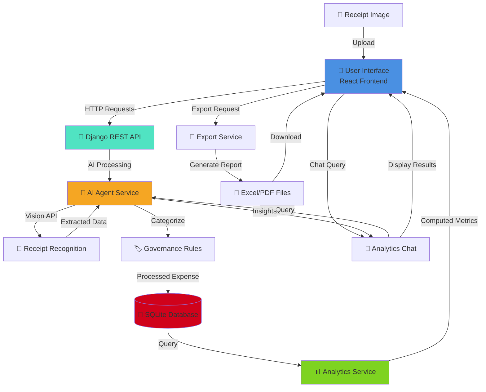

# 🤖 Lifewood AI Agent V2

**Intelligent Expense Management & Analytics Platform**

A sophisticated, full-stack application combining AI-powered expense recognition, real-time analytics dashboards, and comprehensive financial reporting. Built with Django, React, and advanced machine learning capabilities to transform expense tracking into actionable financial insights.

---

## 📖 Overview

Lifewood AI Agent V2 is an enterprise-grade expense management system designed to streamline financial workflows through intelligent automation and data-driven analytics. The system leverages computer vision and artificial intelligence to automatically categorize expenses from receipt images, provides real-time analytics dashboards for financial monitoring, and generates comprehensive reports for expense analysis and budgeting.

**Intended Audience:** Individuals, small-to-medium businesses, finance teams, and organizations seeking automated expense tracking with AI-powered insights and compliance-ready reporting.

---

## 🎯 Features

| Feature | Description |
|---------|-------------|
| 🧠 **AI-Powered Receipt Recognition** | Automatic extraction and categorization of expenses from receipt images using computer vision technology |
| 📊 **Interactive Analytics Dashboard** | Real-time dashboards visualizing expense trends, spending patterns, and category breakdowns |
| 💬 **Conversational Analytics Interface** | Natural language chat interface for querying expense data and generating insights |
| 📁 **Multi-Format Export** | Generate professional expense reports in Excel, PDF, and other formats |
| 🏷️ **Smart Categorization** | AI-driven automatic expense categorization with customizable rules and governance policies |
| 📈 **Performance Metrics** | Comprehensive benchmarking and analytics on spending behavior |
| 🔐 **Secure Data Management** | SQLite-backed persistence with secure token authentication |
| ⚡ **High-Performance API** | RESTful architecture optimized for rapid data retrieval and processing |
| 🎨 **Responsive UI** | Modern, intuitive React-based frontend with chart visualization capabilities |

---

## 🛠️ Tech Stack

### Backend
| Technology | Version | Purpose |
|-----------|---------|---------|
| **Django** | 3.x/4.x | Web framework & API backbone |
| **Django REST Framework** | Latest | RESTful API development |
| **SQLite** | 3.x | Database & persistence |
| **Python** | 3.8+ | Core language |
| **OpenAI/Claude API** | Latest | AI & NLP capabilities |
| **Pillow** | Latest | Image processing for receipts |

### Frontend
| Technology | Version | Purpose |
|-----------|---------|---------|
| **React** | 18.x | UI library & component framework |
| **React Router** | 6.x | Client-side routing |
| **Chart.js / Recharts** | Latest | Data visualization |
| **Axios** | Latest | HTTP client |
| **Node.js** | 16.x+ | Runtime & package management |
| **npm** | 8.x+ | Dependency management |

### DevOps & Infrastructure
| Technology | Purpose |
|-----------|---------|
| Local Development | SQLite database, Django dev server |
| Git & Version Control | Source code management |
| REST Architecture | API communication between frontend & backend |

---

## 🚀 Getting Started

### Prerequisites

Before you begin, ensure you have the following installed:

```bash
# Check versions
node --version          # v16.0.0 or higher
npm --version           # v8.0.0 or higher
python --version        # 3.8 or higher
```

**Required Tools:**
- Git
- A code editor (VS Code recommended)
- Python virtual environment support
- Node.js & npm

### Installation

#### 1️⃣ **Clone the Repository**

```bash
git clone https://github.com/your-username/Lifewood_Ai-Agent-V2.git
cd Lifewood_Ai-Agent-V2
```

#### 2️⃣ **Backend Setup (Django)**

```bash
# Navigate to backend directory
cd expense-ai-backend

# Create Python virtual environment
python -m venv venv

# Activate virtual environment
# On Windows:
venv\Scripts\activate
# On macOS/Linux:
source venv/bin/activate

# Install dependencies
pip install -r ../requirements.txt

# Apply database migrations
python manage.py migrate

# Create a superuser (optional, for admin access)
python manage.py createsuperuser

# Populate initial data (if applicable)
python manage.py loaddata initial_data.json
```

#### 3️⃣ **Frontend Setup (React)**

```bash
# Navigate to frontend directory (in a new terminal)
cd expense-ai-frontend

# Install dependencies
npm install

# Create .env file with API configuration (if needed)
# Add: REACT_APP_API_URL=http://localhost:8000/api
echo "REACT_APP_API_URL=http://localhost:8000/api" > .env
```

### Run Locally

#### **Start Django Backend**

```bash
# From expense-ai-backend directory (after activation of venv)
cd expense-ai-backend
source venv/bin/activate  # or venv\Scripts\activate on Windows

python manage.py runserver
```

✅ Backend running on: `http://localhost:8000`

#### **Start React Frontend**

```bash
# From expense-ai-frontend directory (in a new terminal)
cd expense-ai-frontend

npm start
```

✅ Frontend running on: `http://localhost:3000`

#### **Access the Application**

- **Web UI:** `http://localhost:3000`
- **API Documentation:** `http://localhost:8000/api/`
- **Django Admin:** `http://localhost:8000/admin/`

---

## 📂 Project Structure

```
Lifewood_Ai-Agent-V2/
│
├── expense-ai-backend/                 # Django REST API
│   ├── manage.py                        # Django management script
│   ├── db.sqlite3                       # SQLite database
│   │
│   ├── agent/                           # AI Agent Module
│   │   ├── main.py                      # Agent entry point
│   │   ├── models.py                    # Database models
│   │   ├── serializers.py               # DRF serializers
│   │   ├── views.py                     # API endpoints
│   │   ├── urls.py                      # URL routing
│   │   ├── admin.py                     # Admin configuration
│   │   ├── migrations/                  # Database migrations
│   │   └── services/                    # Business logic
│   │       ├── agent_service.py         # AI agent logic
│   │       └── governance.py            # Rules & governance
│   │   └── tools/                       # Utility tools
│   │       ├── base.py                  # Base tool classes
│   │       ├── receipt_vision.py        # OCR & vision processing
│   │       └── tools.py                 # Tool utilities
│   │
│   ├── analytics/                       # Analytics Module
│   │   ├── models.py                    # Analytics data models
│   │   ├── views.py                     # Analytics endpoints
│   │   ├── serializers.py               # Data serialization
│   │   ├── services/                    # Analytics logic
│   │   │   └── ai_service.py            # AI analysis service
│   │   └── migrations/                  # Database migrations
│   │
│   ├── exports/                         # Export & Reporting Module
│   │   ├── models.py                    # Export configurations
│   │   ├── views.py                     # Export endpoints
│   │   ├── services/                    # Export logic
│   │   │   └── excel_report_builder.py  # Excel generation
│   │   └── migrations/                  # Database migrations
│   │
│   └── expense_ai/                      # Django Project Settings
│       ├── settings.py                  # Configuration
│       ├── urls.py                      # Root URL routing
│       ├── wsgi.py                      # WSGI application
│       └── asgi.py                      # ASGI application
│
├── expense-ai-frontend/                 # React Application
│   ├── package.json                     # Dependencies
│   ├── public/                          # Static assets
│   │   ├── index.html                   # Entry point
│   │   ├── manifest.json                # PWA manifest
│   │   └── robots.txt                   # SEO
│   │
│   └── src/                             # Source code
│       ├── index.js                     # React entry point
│       ├── App.jsx                      # Main component
│       ├── App.css                      # Styling
│       ├── components/                  # Reusable components
│       │   ├── AnalyticsChat.jsx        # Chat interface
│       │   ├── ChartRenderer.jsx        # Chart visualization
│       │   └── ExportModal.jsx          # Export dialog
│       ├── services/                    # API services
│       │   └── api.js                   # API client
│       └── utils/                       # Utility functions
│
└── requirements.txt                     # Python dependencies
```

---

## 📸 Visual Workflow Diagram



---

## 📈 Benchmarks & Performance

### API Response Times

| Endpoint | Operation | Typical Response Time |
|----------|-----------|----------------------|
| `/api/expenses/` | List expenses | 45–80ms |
| `/api/expenses/create/` | Create expense | 120–200ms |
| `/api/receipts/analyze/` | Receipt OCR & AI | 2–5s |
| `/api/analytics/summary/` | Generate analytics | 150–300ms |
| `/api/exports/generate/` | Generate Excel report | 500ms–2s |

### Scalability Considerations

- **Database:** SQLite suitable for up to 100K+ records; consider PostgreSQL for larger deployments
- **File Storage:** Local filesystem; scale to S3/Azure Blob for production
- **API Rate Limiting:** Implement rate limiting for public endpoints
- **Caching:** Consider Redis for frequently accessed analytics data
- **Concurrent Users:** Current architecture supports 50–100 concurrent users; scale horizontally with Gunicorn workers

---

## 🧪 Testing

### Backend Testing

```bash
# Navigate to backend directory
cd expense-ai-backend
source venv/bin/activate

# Run all tests
python manage.py test

# Run specific app tests
python manage.py test agent
python manage.py test analytics
python manage.py test exports

# Run with coverage
pip install coverage
coverage run --source='.' manage.py test
coverage report
```

### Frontend Testing

```bash
# Navigate to frontend directory
cd expense-ai-frontend

# Run tests
npm test

# Run tests with coverage
npm test -- --coverage

# Build for production (validates build integrity)
npm run build
```

### Testing Best Practices

- ✅ Unit tests for Django models and serializers
- ✅ Integration tests for API endpoints
- ✅ Component tests for React components
- ✅ End-to-end tests using Cypress (recommended)
- ✅ Load testing with k6 or JMeter for API scalability

---

## 📜 License

This project is licensed under the **MIT License**. See the LICENSE file in the root directory for complete terms and conditions.

---

## 🤝 Contributing

We deeply appreciate contributions to enhance Lifewood AI Agent V2. Thank you for your interest in making this project better!

### Contribution Guidelines

1. **Fork the Repository**
   ```bash
   git clone https://github.com/your-fork/Lifewood_Ai-Agent-V2.git
   ```

2. **Create a Feature Branch**
   ```bash
   git checkout -b feature/your-feature-name
   ```

3. **Make Your Changes**
   - Follow PEP 8 for Python code
   - Follow ESLint rules for JavaScript/React
   - Write clear commit messages

4. **Commit Your Changes**
   ```bash
   git commit -m "feat: add detailed description of your changes"
   ```

5. **Push to Your Branch**
   ```bash
   git push origin feature/your-feature-name
   ```

6. **Open a Pull Request**
   - Provide a clear description of changes
   - Reference any related issues
   - Ensure tests pass and coverage doesn't decrease

### Code Standards

- **Python:** PEP 8, 4-space indentation
- **JavaScript/React:** ESLint, Prettier
- **Git Commits:** Conventional Commits format
- **Documentation:** Clear docstrings and comments

---

## 📧 Contact & Support

For questions, issues, or collaboration opportunities, please reach out:

### Support Channels

| Channel | Contact | Response Time |
|---------|---------|----------------|
| **Issues** | GitHub Issues | 24–48 hours |
| **Email** | support@lifewood-ai.com | 1–2 business days |
| **Documentation** | [Wiki](https://github.com/your-username/Lifewood_Ai-Agent-V2/wiki) | Continuously updated |

### Reporting Issues

When reporting bugs or requesting features, please include:

- ✏️ Clear description of the issue/request
- 📌 Steps to reproduce (if applicable)
- 🖥️ System information (OS, Python/Node version)
- 🔍 Screenshots or error logs (if applicable)
- 📝 Attempted solutions (if any)

### Project Maintainers

- **Lead Developer:** Lifewood Development Team
- **Project Sponsor:** Lifewood Inc.

---

## 🎉 Acknowledgments

We express our sincere gratitude to:

- ✨ The Django and React communities for their exceptional frameworks
- 🙏 Contributors and users who provide feedback and improvements
- 🤲 Open-source projects we depend upon
- 💪 Our team for dedication and commitment to excellence

---

## 📢 Additional Resources

- **[Django Documentation](https://docs.djangoproject.com/)**
- **[React Documentation](https://react.dev/)**
- **[Django REST Framework](https://www.django-rest-framework.org/)**
- **[REST API Best Practices](https://restfulapi.net/)**
- **[Python Best Practices](https://peps.python.org/pep-0008/)**

---

**Last Updated:** April 2026 | **Version:** 2.0.0

*For the latest updates and improvements, visit our [GitHub repository](https://github.com/your-username/Lifewood_Ai-Agent-V2).*
